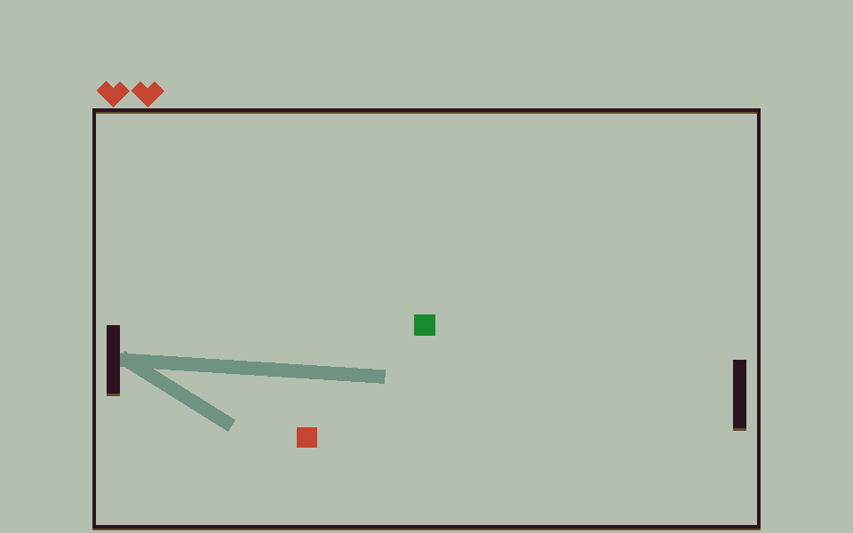

# Serpent Rally

Author: Jonathan Yan

Design: A twist on the classic game of snake with a new way to navigate the serpent.

Screen Shot:

How To Play:

As with classic snake, the goal of the game is to create the longest snake without dying. Eating green fruits will increase the length and speed of the snake, making it harder to navigate the field. Colliding with the left/right walls or parts of yourself will take away hearts, while eating elusive red fruits will recover hearts.

W/A moves the left paddle, while the mouse controls the right paddle. The game ends when all hearts are lost, and any button can be pressed to restart the game.

This game was built with [NEST](NEST.md).
